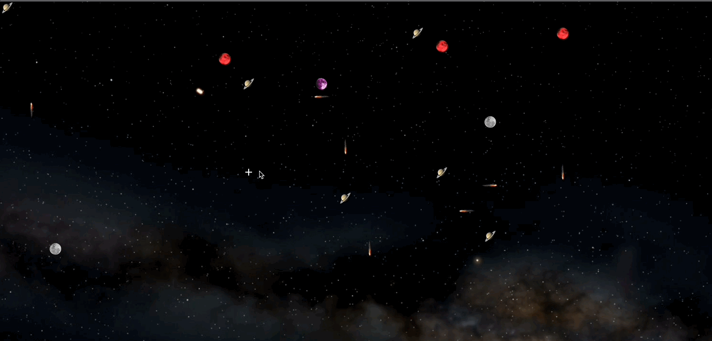

# Crossmint Challenge - Guillermo Aszyn

## Phase 1: Polyanet Cross

To create a polyanet cross you have to enter the phase1 project and first run 

```
npm install
```

then run the command 

```
npm run create-polyanet-cross -- --candidate-id={CANDIDATE_ID}
```

Change `{CANDIDATE_ID}` with the candidate id map you want to create the cross too.


## Phase 2: Galaxy UI

For running the app first enter the phase2 folder. run `npm install` and after `npm start`. You can access the app in [http://localhost:300](http://localhost:300)

Here is a gif showing how the app works:


